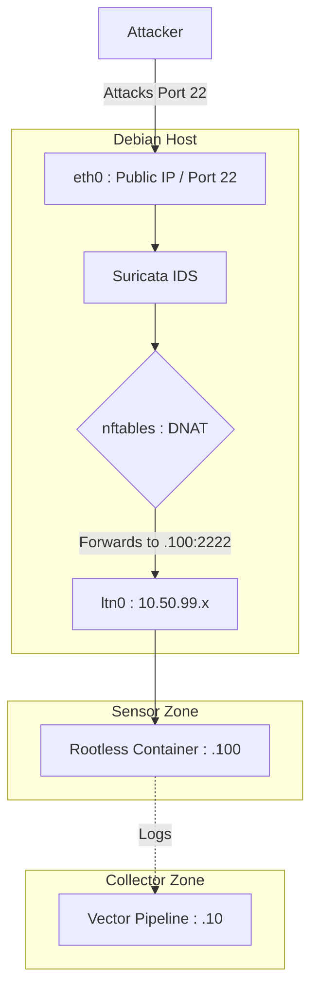
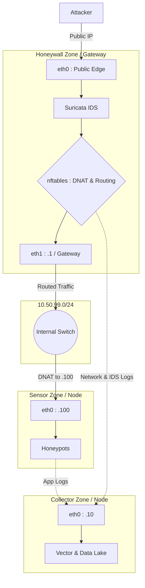

# Lantana: Architecture and Requirements
This document outlines the foundational prerequisites, architectural design, and technical stack required to deploy and operate the Lantana adversary engagement platform.

---

## 1. Prerequisites and Sizing
Lantana is designed to be lightweight but requires specific resource allocations depending on the chosen deployment topology. The platform expects [Debian 13](https://www.debian.org/releases/trixie/) as the base operating system, running either on virtual machines (recommended for snapshotting and rotation) or bare-metal hardware.

### Hardware Guidelines
The following table outlines the minimum hardware requirements for each logical zone. Sizing assumes standard workloads (e.g., a decoy running 5 concurrent low-interaction honeypots like Cowrie and Dionaea).

| Deployment Role | vCPUs | RAM | Storage | Network Interfaces (NICs) | Notes |
| --- | --- | --- | --- | --- | --- |
| **Honeywall** | 2 | 1 GB | 5 GB | 2 (1 Public, 1 Private) | Runs `nftables`, `suricata`, and `vector`. Acts as the security gateway. |
| **Sensor (Low-Interaction)** | 2 | 2 GB | 20 GB | 1 (Private) | Runs `podman` and `vector`. Hosts multiple containerized decoys. |
| **Collector** | 1 | 1 GB | 50 GB | 1 (Private) | Runs `vector` and custom Python scripts. Storage scales with data retention needs. |
| **Single-Node (All-in-One)** | 2 | 4 GB | 80 GB | 1 Physical + 1 Dummy | Ideal for VPS/edge deployments. All zones run concurrently on one host. |

> [!NOTE]
> High-interaction honeypots (fully vulnerable OS deployments) have variable hardware requirements based on the specific operating system and narrative being emulated. They must only be deployed in Multi-Node mode as dedicated hosts.

---

## 2. Platform Lifecycle & Provisioning Strategy
Lantana strictly separates infrastructure provisioning from behavioral configuration. This ensures that the underlying compute resources remain disposable and the deception narratives remain highly modular.

### Day 0: Provisioning (Terraform)
Terraform is responsible for the "physical" or hypervisor-level reality. It deploys the raw Debian virtual machines, creates the virtual networks (public and private), and injects the baseline network and security configurations via `cloud-init`. 

Specifically, Terraform delivers bare, network-reachable OS instances by:

- Setting static IP addresses and default gateways.
- Creating the baseline administrative user and injecting the required SSH Public Key.
- **Disabling SSH password authentication** and **binding the SSH daemon directly to the custom administrative port** at boot. This closes the vulnerability window against automated botnets and ensures port 22 is never exposed.

> [!NOTE]
> Full Terraform automation is planned for a future release. Currently, base VMs are assumed to be pre-provisioned following these exact networking and SSH baselines.

### Day 1: Configuration (Ansible)
Ansible assumes control of the reachable, baseline-secured nodes. Connecting natively on the custom SSH port using the injected key, Ansible applies deeper system hardening before laying down the deception "Narrative".

Ansible is specifically responsible for:

- Shifting the SSH daemon to a custom, non-standard administrative port.
- Applying strict cryptographic policies and further `sshd_config` lockdowns (e.g., SSH certificates).
- Installing the required platform packages (`podman`, `vector`, `suricata`).
- Configuring OS-level networking (dummy interfaces, `nftables` routing, and DNAT).
- Deploying the specific honeypot containers and telemetry pipelines.

This separation means an operator can completely destroy and rebuild the Terraform infrastructure without touching the Ansible deception logic, or conversely, rotate the Ansible honeypot narrative multiple times on the same Terraform-provisioned infrastructure.

---

## 3. Architecture
With the hosts provisioned, Lantana is structured around a **zoned architecture**. Each zone enforces a strict security and functional boundary.

### Logical Zones
- **Honeywall Zone:** The network safeguard. It protects the public interface, enforcing strict egress filtering via [nftables](https://www.netfilter.org/projects/nftables/index.html) to ensure compromised decoys cannot be weaponized. It utilizes an IDS ([Suricata](https://suricata.io/)) to identify attacks and monitors connection logs. The Honeywall never hosts decoys.
- **Sensor Zone:** The deception runtime. This zone runs the actual honeypots. Low-interaction honeypots run inside isolated, hardened [podman](https://podman.io/) containers. It is responsible for capturing attacker interactions, performing lightweight local log parsing, and forwarding telemetry.
- **Collector Zone:** The data brain. Explicitly out-of-band and never exposed to adversaries, this zone receives parsed logs from the Honeywall and Sensor zones. It enriches the data, normalizes it into OCSF format, builds the central data lake, and periodically persists the data to secure external storage.

### Modes of Operation
The platform seamlessly supports two deployment models without altering the underlying logical architecture:

1. **Multi-Node Mode (Production/Research):** Zones are distributed across multiple hosts. The Honeywall is the *only* node directly exposed to the internet. Sensor and the Collector zones sit on a private network, using the Honeywall as their gateway. This mode allows for deploying **High-Interaction** honeypots (dedicated bare-metal or VMs) safely behind the Honeywall's containment policies.
2. **Single-Node Mode (Edge/Lightweight):** All three zones operate on the same physical or virtual host. To maintain routing and policy logic, Lantana creates a "dummy" network interface (NIC) to simulate the private network boundary. Containment is enforced locally via local nftables rules and container isolation. Only Low-Interaction decoys are supported in this mode.

---

## 4. Network Topology & Addressing
Lantana relies on strict network segmentation to isolate attackers, translate traffic, and securely route telemetry. Whether running on a single host or distributed across multiple nodes, the internal IP schema relies on isolated, non-routable subnets.

### Internal IP Schema (RFC 1918 & ULA)
To ensure traffic cannot accidentally leak onto public internet backbones, Lantana uses private addressing for internal zones:

- **IPv4:** `10.50.99.0/24`
- **IPv6 (ULA):** `fd99:10:50:99::/64`

> [!NOTE]
> Always use Unique Local Addresses (ULA, `fd00::/8`) for internal IPv6 routing. Link-Local addresses (`fe80::/10`) require Scope IDs and are unsuitable for reliable container routing or firewall rules. Public Global Unicast Addresses (GUA) are only assigned to the Honeywall's external interface.

---

### Single-Node Topology
In Single-Node mode, the hypervisor (or base OS) provides a NAT network. Since all zones share the same host, Lantana creates a **dummy interface (`ltn0`)** to act as a hidden internal switch. The Honeywall binds the public IP, while the Collector and Sensor zones bind to the dummy interface.

#### IP Assignments
- **Honeywall (`eth0` - Gateway):** Implicitly the host OS firewall (`nftables`) and IDS (`Suricata`).
- **Collector Zone (`ltn0`):** `10.50.99.10` / `fd99:10:50:99::10`
- **Sensor Zone (`ltn0` - Decoys):** `10.50.99.100` / `fd99:10:50:99::100`

#### Packet Flow
1. An attacker hits the public IP (`eth0`) on port 22.
2. The Honeywall applies strict IDS inspection (`Suricata`) to identify threats, while `nftables` (PREROUTING) intercepts the packet, performing DNAT to rewrite the destination to the dummy interface (`10.50.99.100:2222`).
3. Podman's rootless proxy listens on `.100` and forwards the traffic into the isolated honeypot container.
4. Telemetry is written locally, picked up by Vector (listening on `.10`), and pushed to the data lake.



---

### Multi-Node Topology
In Multi-Node mode, physical or virtual separation replaces the dummy interface. The Honeywall acts as a dedicated security gateway (router/firewall) with two Network Interfaces (NICs). The Sensor and Collector zones reside on a private backend network with no direct internet access.

#### IP Assignments
- **Honeywall (eth0):** Public IP / Public IPv6 (GUA)
- **Honeywall (eth1 - Gateway):** `10.50.99.1` / `fd99:10:50:99::1`
- **Collector Node (eth0):** `10.50.99.10` / `fd99:10:50:99::10`
- **Sensor Node (eth0):** `10.50.99.100` / `fd99:10:50:99::100`

#### Packet Flow
1. Attacker hits the Honeywall's public interface (`eth0`).
2. The Honeywall applies strict IDS inspection (`Suricata`) and `nftables` DNAT, forwarding the packet out its private interface (`eth1`).
3. The packet traverses the private network and hits the Sensor node (`.100`).
4. The Sensor node records the interaction, and its local Vector agent pushes the parsed telemetry to the centralized Collector node (`.10`).



---

### Ansible Deployment Routing
Because the Sensor and Collector nodes have no public IP in Multi-Node mode, the Ansible control host deploys to them by using the Honeywall as an **SSH Jump Host (Bastion)**. 

In the Ansible inventory, the private nodes are configured to proxy their connection through the Honeywall:

```yaml
all:
  children:
    honeywall:
      hosts:
        hw-node-01:
          ansible_host: <PUBLIC_IP_OF_HONEYWALL>
    sensors:
      hosts:
        sensor-node-01:
          ansible_host: 10.50.99.100
          ansible_ssh_common_args: '-J admin@<PUBLIC_IP_OF_HONEYWALL>'
```
This ensures all infrastructure configuration is deployed securely without exposing internal nodes to the internet.

---

## 5. Technical Stack
Lantana favors modern, native Linux tooling over heavy abstractions. This reduces the attack surface, simplifies auditing, and ensures strict control over system behavior.

### Base Environment
- **Debian:** The secure, stable foundation for all nodes.
- **nftables:** Handles all firewalling, NAT, network segmentation, and strict egress containment policies.
- **systemd:** Manages service orchestration, ensuring honeypots and telemetry pipelines start reliably and recover from crashes.
- **iproute2:** Manages network configurations, routing tables, and the creation of dummy interfaces for Single-Node mode.
- **logrotate & cron:** Manages log retention, rotation, and triggers periodic administrative tasks.

### Specialized Deception & Data Tools
- **Podman:** The container engine for Low-Interaction sensors. Chosen over Docker for its daemonless architecture and native rootless capabilities, providing stronger out-of-the-box isolation.
- **Datadog Vector:** A high-performance, lightweight pipeline tool used across all zones for log ingestion, initial parsing, and fast routing.
- **Suricata:** The Intrusion Detection System (IDS) deployed in the Honeywall to capture network-level threat signatures.
- **Python:** Powers the Collector zone. Used for complex log enrichment (interfacing with APIs like VirusTotal, AbuseIPDB, and Shodan), data lake formatting (Parquet), and operating the data exploration tools.
- **Terraform & Ansible:** The infrastructure-as-code backbone. Terraform provisions the raw compute resources, while Ansible applies the "Narrative".
