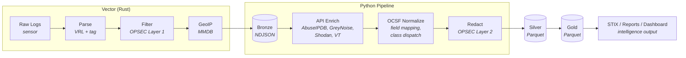

# Lantana: Data Pipeline

The Lantana data pipeline is a Python application that processes honeypot telemetry through a three-tier data lake (bronze, silver, gold), producing enriched Parquet datasets, threat intelligence reports, STIX bundles, and an operator dashboard. It runs on the Collector zone as a set of daily batch jobs orchestrated by cron.

---

## 1. Overview

Vector writes raw honeypot logs to the **bronze** layer as NDJSON files. The Python pipeline reads bronze, enriches it with external threat intelligence APIs, normalizes events to [OCSF](https://ocsf.io/) (Open Cybersecurity Schema Framework), redacts infrastructure IPs (OPSEC), and writes the result to the **silver** layer as Parquet. A second stage aggregates silver into the **gold** layer for dashboards and intelligence output.



### Why Python instead of Vector for enrichment and normalization?

Vector handles high-throughput ingest, parsing, noise filtering, and GeoIP enrichment at wire speed. The Python pipeline handles work that doesn't fit a streaming model:

- **API enrichment** requires rate-limited HTTP calls with caching, retries, and backoff — better suited to async Python with SQLite cache than VRL.
- **OCSF normalization** involves conditional class dispatch (which OCSF event class each raw event maps to) based on event type — complex branching logic that's easier to test and maintain in Python.
- **OPSEC redaction** is a safety-critical step that benefits from Pydantic validation and comprehensive test coverage.
- **Gold aggregation** produces cross-dataset correlations (behavioral progression, campaign clustering) that require Polars DataFrame operations.

Bronze stays raw. This preserves the option to re-normalize if the OCSF mapping changes without re-ingesting from the honeypots.

---

## 2. Datalake Structure

All data lives under `/var/lib/lantana/datalake/` in Hive-style partitions:

```text
/var/lib/lantana/datalake/
├── bronze/                                    # Raw NDJSON (Vector writes)
│   └── dataset={name}/date={YYYY-MM-DD}/server={hostname}/events.json
├── silver/                                    # Enriched + OCSF-normalized Parquet
│   └── dataset={name}/date={YYYY-MM-DD}/server={hostname}/events.parquet
└── gold/                                      # Aggregated intelligence Parquet
    └── {table_name}/date={YYYY-MM-DD}/summary.parquet
```

- **Bronze**: One NDJSON file per dataset/date/server combination. Written by Vector. Contains raw event fields plus Vector-added tags (`dataset`, `server`, `operation`) and GeoIP fields (`geo.*`).
- **Silver**: One Parquet file per partition. Events have OCSF-normalized column names, API enrichment data, and infrastructure IPs replaced with pseudonyms.
- **Gold**: Seven aggregated tables per date: `daily_summary`, `ip_reputation`, `behavioral_progression`, `behavioral_progression_multiday`, `campaign_clusters`, `geographic_summary`, `detection_findings`. Read exclusively from silver.

Multiple operations coexist via the `operation` column tag, not filesystem partitions.

---

## 3. Pipeline Stages

### 3.1 Bronze to Silver (daily enrichment)

Entry point: `lantana-enrich` (cron: 01:00 UTC, processes yesterday's data).

For each dataset (cowrie, suricata, nftables, dionaea):

1. **Read bronze** NDJSON for every dataset into Polars DataFrames
2. **Extract IOCs globally** across all datasets — unique source IPs from every dataset, plus SHA256 hashes from cowrie `file_download` events (`shasum` field) and a defensive disk scan of `sensor/*/downloads`. An IP appearing in both cowrie and suricata is queried once, not twice.
3. **OPSEC-filter IPs** against `reporting.redact.infrastructure_ips` and `infrastructure_cidrs` — defense-in-depth behind Vector's Layer-1 source filter; operation-owned addresses never reach an external provider.
4. **Query enrichment providers** per IOC, cache-first (respecting rate limits):
   - AbuseIPDB (abuse confidence, report count, ISP) — IPs
   - GreyNoise (classification, noise/riot status, last seen, label) — IPs — see [Provider auth modes](#provider-auth-modes)
   - Shodan (open ports, services, vulns) — IPs
   - VirusTotal — IPs (reputation) and SHA256 hashes (file analysis, into `vt_file_*` columns)
5. **Cache results** in SQLite keyed by `(provider, ioc_type, ioc_value)` with a tiered per-row TTL — benign 7d, malicious IPs 60d, malicious domains 90d, malicious hashes 180d (OpenCTI default decay rules). A row is "malicious" iff its provider risk_score ≥ 50. Cache hits short-circuit the HTTP call entirely.
6. **Record errors** — `_classify_http_error` maps statuses to actionable labels (`auth_failed`, `rate_limit`, `not_found`, `server_error`, `network_error`, `timeout`) and writes an NDJSON summary to `enrichment_errors.json`. `auth_failed` is logged at error level (operators must rotate the broken vault key); `not_found` is logged at debug (normal "IP/hash not in DB").
7. **Merge enrichment** per dataset: IP enrichments joined on `src_ip`; hash enrichments joined on `shasum` for cowrie (see [§3.1.1](#311-how-enrichment-merges-into-events))
8. **OCSF normalize** — rename columns and add OCSF metadata (see Section 4)
9. **Redact infrastructure IPs** (OPSEC Layer 2) — replace destination IPs with pseudonyms
10. **Validate no leaks** — assert zero infrastructure IPs in any string column
11. **Write silver** Parquet partitioned by dataset/date/server

> **One-time cache migration note**: the cache schema has gone through two backwards-incompatible migrations. The first (IOC-first refactor) added composite-key `(provider, ioc_type, ioc_value)` in place of a single `key`. The second (tiered-TTL change) added a per-row `expires_at` column so each entry decays under the policy that wrote it. Both are handled by `_init_cache` on first run: it detects the older schema and drops + recreates the table. The data lost is ≤7 days old and providers will refill cheaply — with one exception. Shodan's 100-queries-per-month free tier will burn through quickly on the post-migration first run if the unique IP count is high. Plan the migration run for a low-stakes window; consider invoking `lantana-enrich` manually rather than letting the 01:00 UTC cron fire blind.

#### 3.1.1 How enrichment merges into events

Enrichment is **additive and lossy-tolerant**. A failed provider leaves its columns null on the affected row; a 404 "IP not in dataset" leaves zero/empty values per the provider's "no info" convention. One provider's failure never blocks the others. Concretely:

```text
bronze event (one row per attacker action):
    { src_ip, timestamp, eventid, ..., geo.country_code, geo.asn, ... }
                                       └─ already populated by Vector at ingest

extracted unique IPs:
    ["1.2.3.4", "5.6.7.8", ...]

per provider, per IP:
    EnrichmentResult(provider="abuseipdb", ip="1.2.3.4", data={
        "abuseipdb_confidence_score": 87,
        "abuseipdb_total_reports":   42,
        ...
    })

merged enrichment DataFrame (one row per IP, all providers' fields):
    src_ip      | abuseipdb_* | shodan_* | vt_* | greynoise_*
    1.2.3.4     | filled      | filled   | 404→0 | 404→unknown
    5.6.7.8     | error→null  | filled   | filled | filled

left-joined back onto bronze by src_ip → silver Parquet row:
    { src_ip, timestamp, eventid, ..., geo.*, abuseipdb_*, shodan_*, vt_*, greynoise_* }
```

The runner code lives in [`enrichment/runner.py`](/pipeline/src/lantana/enrichment/runner.py); IOC extraction helpers in [`enrichment/ioc.py`](/pipeline/src/lantana/enrichment/ioc.py):

- `_enrich_iocs_with_provider(provider_name, provider, ioc_type, iocs, cache, errors)` iterates IOCs of one type for one provider. For each IOC: cache-first; on miss it calls `provider.enrich_ip(value)` or `provider.enrich_hash(value)` depending on `ioc_type`, caches the result, appends to the returned list. Exceptions don't propagate — they're recorded into the error file and the IOC just doesn't appear in that provider's result list. Returns `(results, cache_hits)`.
- `_build_lookup(results)` collapses a flat list of `EnrichmentResult` into a per-value merged dict (multiple providers' fields for the same IOC are merged into one entry).
- `_merge_lookup(df, join_col, lookup)` materialises the lookup as a Polars DataFrame and `df.join(enrich_df, left_on=join_col, right_on="_enrich_key", how="left")`. The left-outer-join is the key — bronze rows without any provider hits still come through to silver, just with null enrichment columns. The same helper handles both `src_ip → IP enrichments` and `shasum → hash enrichments`.
- The provider classes themselves catch the routine "no info" cases (GreyNoise 404, Shodan 404, VirusTotal 404 for IPs and hashes) and return normalized records with zero/empty fields rather than raising. This keeps the runner's error path reserved for actual failures (auth, rate limit, server error, transport timeout).

Retry semantics: tenacity wraps `provider.enrich_ip` / `enrich_hash` with 3 attempts on 429 / 5xx / transport errors only, with `reraise=True` so the original `httpx.HTTPStatusError` / `TimeoutException` / `ConnectError` propagates to the runner and gets classified — never wrapped in a `RetryError`. 4xx other than 429 fails fast — retrying on a bad API key or a malformed request wastes the rate-limit budget without changing the outcome.

### 3.2 Silver to Gold (daily aggregation)

Entry point: `lantana-transform` (systemd timer at 04:00 UTC, processes yesterday's data).

Reads all silver Parquet for the target date (cross-dataset), collects into a single DataFrame, and computes gold tables covering: daily aggregate statistics, per-IP risk scoring (decomposed into per-provider, enrichment-aggregate, behavioral, and composite scores — see §3.2.1), behavioral progression staging (scan -> credential -> authenticated -> interactive), cross-day slow-burn detection (7-day lookback), credential-sharing campaign clusters, geographic distribution of attack origins, and IDS detection finding statistics.

Gold tables are the single source of truth for all downstream output (STIX, reports, dashboard). Each table is a pure DataFrame transform — no side effects, no external calls. See [`transform/metrics.py`](/pipeline/src/lantana/transform/metrics.py) for table definitions and computation logic, and [`transform/runner.py`](/pipeline/src/lantana/transform/runner.py) for orchestration.

#### 3.2.1 Risk score composition

Per-IP scoring lives in two layers — per-provider sub-scores in silver (one column per provider, joined onto every event for that source IP), then a composite computed in `compute_ip_reputation` in gold. The gold table `ip_reputation` carries seven score-related columns:

| Column | Where computed | Meaning |
|---|---|---|
| `abuseipdb_risk_score` | Silver (provider) | AbuseIPDB confidence, 0..100, pass-through |
| `virustotal_risk_score` | Silver (provider) | Bucketed VT malicious-engine count |
| `shodan_risk_score` | Silver (provider) | Tri-state: 0 / 25 (ports only) / 100 (CVE present) |
| `greynoise_risk_score` | Silver (provider) | Classification matrix with RIOT short-circuit to 0 |
| `enrichment_risk_score` | Gold | `mean_horizontal` of the four above, skipping nulls |
| `behavioral_risk_score` | Gold | Honeypot-activity signals (auth + commands + downloads + findings) |
| `risk_score` | Gold (final) | `(enrichment.fill_null(0) + behavioral) / 2` — the single number downstream consumers read |

**Why three scores instead of one.** The previous single-formula `risk_score` blended enrichment and behavioral signals into one opaque number — `risk_score=80` could be "highly intel-flagged IP that did nothing" or "innocent-looking IP that hit interactive shell." The Phase D.2 decomposition lets an analyst answer *which signal drove the score* without re-running anything. STIX gate, dashboard buckets, and Discord top-5 sorting still read the composite `risk_score`; consumers wanting the breakdown can read the sub-scores directly.

**Why RIOT subtracts.** GreyNoise's RIOT (Rule-It-Out) flag marks IPs as known-benign infrastructure (CDNs, NTP, DNS resolvers, Censys, etc.). When RIOT fires, `greynoise_risk_score` short-circuits to 0, pulling the enrichment mean down — but the row stays in silver with all enrichment intact so an analyst can still see what the other providers said. This prevents false-positive Indicators in STIX export.

For full per-provider formulas, value ranges, worked examples, and the FAQ, see [docs/risk-scoring.md](/docs/risk-scoring.md).

### 3.3 Intelligence Output

All three output channels read exclusively from gold tables (already OPSEC-redacted). The specific sections, visualizations, and object types are defined in source code and may evolve — this document describes the architecture, not the exact content.

#### STIX 2.1 Bundles

Generated from gold data via [`intel/stix.py`](/pipeline/src/lantana/intel/stix.py). Produces a STIX Bundle with IP indicators (risk-based threshold), campaign objects (credential clusters), malware indicators (captured file hashes), IDS finding indicators (broadly-triggered detection rules), and relationship objects linking them. Each indicator includes enrichment context from all available providers (GeoIP, AbuseIPDB, GreyNoise, Shodan, VirusTotal) in its description and labels.

OPSEC enforcement: the bundle serializer asserts no infrastructure IPs appear in the output. Gold reads only from redacted silver, providing defense in depth.

Available via the Streamlit dashboard (download button) or programmatic API.

#### Discord Intel Reports

Generated from gold data via [`notify/report.py`](/pipeline/src/lantana/notify/report.py), sent via `lantana-report` (06:00 UTC daily, merged with the legacy `lantana-alert` flow — embed colour follows max enrichment-error severity, brief always posts). The daily brief covers pipeline health + timing (operator self-check), key metrics, geographic origin, escalation funnel with stage legend, top attackers (with the `(enrichment+behavioral)/2` decomposition and per-provider risk quadruplet), threat actor attribution, notable escalations, campaign clusters with a rank-numbered IPs list, detection highlights, malware captured (top hashes + VT context), and top credentials/commands. The brief footer points at the dashboard's **STIX Export** page for the curated STIX 2.1 bundle and the raw IOC CSV — the long-tail IOC inventory lives there, not inline. The Discord embed itself is a short summary; the full Markdown report is attached as a `.md` file.

Section captions and dashboard widget tooltips share one source — `WhatWhyHow` triplets in [`notify/explanations.py`](/pipeline/src/lantana/notify/explanations.py) (`BRIEF_SECTIONS` + `METRICS`). Adding inline `help=` or `st.caption()` literals on a dashboard page is drift; route through the registry so the brief can reuse the same text.

#### Streamlit Dashboard

Entry point: `lantana-dashboard`. The dashboard is the operator's personal console — never shared externally. Peers receive Discord reports and STIX bundles. Pages cover operational overview, geographic analysis (world map, country/ASN/city breakdowns), per-IP risk profiles with full enrichment detail, behavioral progression analysis, IDS detection findings, credential intelligence, and STIX export. See [`dashboard/pages/`](/pipeline/src/lantana/dashboard/pages) for the current page set.

The dashboard binds to `localhost:8501` only (OPSEC Layer 3 — never exposed externally). Reach it via SSH local-port-forwarding from the operator workstation; see [`setup.md` §11 → "Inspect the dashboard + export STIX"](/docs/setup.md#inspect-the-dashboard--export-stix) for the exact pattern. STIX bundles are generated on-demand from the dashboard's STIX Export page and streamed to the operator's browser — not stored server-side.

#### Verification playbooks

Two Ansible playbooks codify the post-deploy invariants — these are the canonical health checks, not eyeball-driven walkthroughs:

* [`config/ansible/tests/validate-single-node.yml`](/config/ansible/tests/validate-single-node.yml) — runs immediately after `deploy_single.yml`. Asserts users, SSH, network, firewall, logrotate files, GeoIP cron, and the four `lantana-*.timer` units (installed + enabled).
* [`config/ansible/tests/validate-pipeline-cycle.yml`](/config/ansible/tests/validate-pipeline-cycle.yml) — runs after the first 06:00 UTC cycle. Asserts each pipeline systemd unit's last `Result=success`, `run_summary` in journal, silver+gold parquet presence, `.provider_state.json` exists, no API-key residue in `enrichment_errors.json`, per-provider `<provider>_risk_score` columns in silver, gold composite + sub-scores + the GreyNoise RIOT invariant. `target_date` defaults to yesterday UTC; override via `-e target_date=YYYY-MM-DD`.

Visual / browser-driven checks (Discord report rendering, dashboard pages, STIX bundle download) stay manual — see `setup.md` §11.

---

## 4. OCSF Normalization

The pipeline normalizes bronze events to [OCSF v1.3.0](https://schema.ocsf.io/1.3.0/) during the bronze-to-silver transition. Each raw event is classified into an OCSF event class based on its source dataset and event type, using a dispatch model:

1. **Class dispatch** — Each dataset (Cowrie, Suricata, nftables, Dionaea) has a normalizer function that inspects event fields (e.g., `eventid`, `event_type`, `credential_username`) to determine the OCSF event class: Authentication (3002), Process Activity (1007), File Activity (1001), Detection Finding (2004), or Network Activity (4001 — the fallback).
2. **Field mapping** — Raw fields are renamed to OCSF equivalents (e.g., `src_ip` -> `src_endpoint_ip`, `timestamp` -> `time`). Some fields are conditionally mapped based on event type (e.g., `password` only populated for login events). Intel-valuable fields (passwords, protocols, alert metadata) are never dropped during mapping.
3. **OCSF metadata** — Generated columns (`class_uid`, `category_uid`, `severity_id`, `activity_id`, `type_uid`, `status_id`) are added based on the dispatched class and event context.
4. **Passthrough** — Vector tags (`dataset`, `server`, `operation`), GeoIP fields (`geo.*`), and API enrichment columns (`abuseipdb_*`, `greynoise_*`, `shodan_*`, `vt_*`) pass through untouched.

The OCSF schema contract is defined in [`models/ocsf.py`](/pipeline/src/lantana/models/ocsf.py). Per-dataset normalization logic (class dispatch, field mapping, and metadata generation) is in [`models/normalize.py`](/pipeline/src/lantana/models/normalize.py).

---

## 5. OPSEC: Three-Layer IP Redaction Model

Lantana produces shareable intelligence (Discord reports, STIX bundles). The primary OPSEC concern is **external/WAN IP leakage** — the public-facing addresses that identify the honeypot on the internet. If an attacker or peer discovers these, they can blacklist the honeypot, fingerprint the setup, or map the operator's infrastructure. Only the honeypot owner should know these addresses.

Three layers enforce this, each catching what the previous layer might miss:

### Layer 1: Vector Noise Filter (Sensor/Honeywall)

- **Where**: VRL transforms in each honeypot's Vector pipeline, before data leaves the sensor.
- **What**: Drops events where the source IP is not an external attacker. Filtered sources: loopback (`127.0.0.0/8`, `::1`), internal network prefixes (`network.prefixes.ipv4`, `network.prefixes.ipv6`). This catches health check probes, inter-zone traffic, and operational noise.
- **Why here**: Eliminating noise at the earliest point reduces data volume, prevents internal IPs from reaching the datalake, and avoids polluting enrichment queries with non-attacker IPs.
- **Pattern**: Each honeypot role's Vector config includes a `filter_<honeypot>` transform using `ip_cidr_contains!()` against the operation's network prefixes. Every new honeypot role must replicate this filter.

### Layer 2: Silver Redaction (Python Pipeline)

- **Where**: `common/redact.py`, called during bronze-to-silver enrichment.
- **What**: Replaces infrastructure **destination** IPs with pseudonyms. External/WAN IPs are the primary target (e.g., `172.31.99.129` -> `honeypot-wan`), but internal IPs are also redacted for defense in depth. After replacement, `validate_no_leaks()` scans every string column and asserts zero infrastructure IPs remain — both direct matches and CIDR containment checks.
- **Why here**: Layer 1 filters by source IP; Layer 2 handles destination IPs that appear in event data (the honeypot's own address). This is the last point where the pipeline has access to the real IPs (via `reporting.json` pseudonym map).
- **Configuration**: Controlled by `reporting.json` -> `redact.infrastructure_ips`, `redact.infrastructure_cidrs`, and `redact.pseudonym_map`. The Ansible template merges infrastructure IPs from `network.yml` at deploy time.

### Layer 3: Gold/Reports/STIX Absence (Python Pipeline)

- **Where**: Gold aggregation, Discord reports, STIX bundles.
- **What**: Gold reads exclusively from silver (already redacted). The STIX bundle serializer asserts no infrastructure IPs in the output JSON. Discord reports are generated from gold data only. Reports never contain: honeypot WAN IPs, internal IPs, server hostnames, network topology, SSH admin port, interface names, or CIDRs.
- **Why here**: Defense in depth. Even if a bug in Layer 2 allowed a leak into silver, Layer 3 would catch it at output time. The STIX assertion is an explicit programmatic check, not just a data flow guarantee.

---

## 6. Operational Tools

### lantana-prune (retention and disk monitoring)

Entry point: `lantana-prune` (cron: 00:15 UTC daily).

1. **Standard prune**: Delete datalake date partitions and sensor artifacts (downloads, TTY recordings) older than 180 days
2. **Disk check**: Measure filesystem usage on the datalake volume
3. **Warning** (>70%): Send Discord notification via `lantana-notify`
4. **Critical** (>80%): Emergency prune — delete sensor artifacts older than 14 days (preserves recent forensic evidence), then send critical alert with before/after usage percentages

### lantana-notify (Discord notifications)

Entry point: `lantana-notify --level <info|warning|critical> --title "..." --message "..."`

General-purpose Discord webhook notification utility. Used by:

- `lantana-prune` for disk alerts
- `lantana-report` for daily intel briefs

Webhook URL resolution chain: `--webhook-url` CLI flag > `LANTANA_DISCORD_WEBHOOK` env var > `discord_webhook` in `secrets.json`.

Notifications use Discord embeds with color-coded severity (green=info, orange=warning, red=critical) and optional file attachments. Retries 3 times with exponential backoff on failure.

---

## 7. Deployment

The pipeline is deployed by Ansible as part of the `profile_collector` role:

1. **Source clone**: shallow `git clone` of the public repo (default `https://github.com/lopes/lantana.git`, configurable via `lantana_repo_url` and `lantana_repo_ref`) into `/opt/lantana/repo/`. The ref defaults to `main`; an operation can pin a tag or commit for reproducibility.
2. **Virtual environment**: managed by `uv` (pinned via `roles/base/defaults/main.yml`) at `/opt/lantana/pipeline/venv/`. The Python interpreter comes from the system (`UV_PYTHON_DOWNLOADS=never`), not uv-managed.
3. **Package install**: `uv sync --frozen --project /opt/lantana/repo/pipeline/`. `--frozen` enforces exact versions from the checked-in `uv.lock` — any drift fails the deploy rather than silently picking newer transitives.
4. **Schedule** — pipeline jobs run as systemd `oneshot` services triggered by matching `.timer` units (deployed to `/etc/systemd/system/`). GeoIP refresh is still a cron entry (`/etc/cron.d/lantana-geoip-update`) since it's monthly and needs root.

| Time (UTC) | Unit / Job | Description |
| --- | --- | --- |
| 00:15 daily | `lantana-prune.service` | Retention + disk monitoring |
| 01:00 daily | `lantana-enrich.service` | Bronze → silver (yesterday) |
| 04:00 daily | `lantana-transform.service` | Silver → gold (yesterday) — 3h margin after enrich because VT throttle can stretch it |
| 06:00 daily | `lantana-report.service` | Merged daily flow: enrichment-error severity classification (replaces the retired `lantana-alert.timer`) + full intel brief, always posts |
| 02:30 monthly (1st) | `lantana-geoip-update` (cron) | Refresh MaxMind City + ASN MMDBs |

All pipeline services run as the `nectar` user (UID 2002), which owns the datalake directories. The GeoIP refresh runs as root (writes the MMDBs and restarts Vector). The pipeline reads `secrets.json` and `reporting.json` from `/etc/lantana/collector/`. Query a service's last run via `journalctl -u <name>.service`; see next-fire times via `systemctl list-timers`.

---

### 7.1 Third-Party Integrations

Enrichment providers, their endpoints, free-tier limits, extracted fields, and live-probe workflows live in [`integrations.md`](/docs/integrations.md). Quick reference:

| Stage | Provider | Auth | Free-tier limit |
|---|---|---|---|
| Wire-speed (Vector, local MMDB) | MaxMind GeoLite2 | License key required for download | Free with signup; weekly updates |
| Daily batch (Python pipeline)   | AbuseIPDB        | `Key:` header, required               | 1000 checks/day |
| Daily batch                     | Shodan           | `key=` query param, required          | ~100 queries/month (Membership) |
| Daily batch                     | VirusTotal       | `x-apikey:` header, required          | 4 req/min, 500/day |
| Daily batch                     | GreyNoise        | `key:` header, **optional**           | 50 searches per 7 days (unauthenticated) |

See [`integrations.md`](/docs/integrations.md) for endpoint URLs, per-provider field extraction, the probe scripts (`probe-enrichment.py` for HTTP providers, `probe-mmdb.py` for MaxMind), and historical incidents.

### 7.2 Provider Auth Modes

Not every enrichment provider requires an API key. The vault file controls per-provider enablement and authentication:

| Provider | Endpoint requires auth? | Behaviour when vault var is **missing** | Behaviour when vault var is **`""`** (empty) | Behaviour when vault var is **set** |
|---|---|---|---|---|
| AbuseIPDB | Yes | Provider runs with empty key → 401 (treat as misconfiguration) | Same as missing | Authenticated |
| Shodan | Yes | Same as above | Same as above | Authenticated |
| VirusTotal | Yes | Same as above | Same as above | Authenticated |
| **GreyNoise** | **No (community)** | **Provider skipped** | **Anonymous community queries** | **Community queries with `key` header (higher rate limit)** |

In short: GreyNoise can run on the free public endpoint with zero credentials, and the vault still controls whether it runs at all.

### GreyNoise

Uses the [GreyNoise Community API](https://docs.greynoise.io/docs/using-the-greynoise-community-api) at `https://api.greynoise.io/v3/community/{ip}`. Response surfaces `noise`, `riot`, `classification`, `name`, `last_seen`, and `link` — captured in silver as `greynoise_noise`, `greynoise_riot`, `greynoise_classification`, `greynoise_name`, `greynoise_last_seen`, `greynoise_link`.

- Free / unauthenticated quota: **50 searches per 7 days**, shared with the GreyNoise Visualizer.
- HTTP 404 responses are treated as "no info" (the IP is not in the dataset) — silver receives a row with `greynoise_classification = "unknown"` rather than an enrichment error.
- Setting `vault_apikey_greynoise: ""` opts in to anonymous community queries. Setting it to a real key raises the rate limit and adds the `key` header; the response shape is identical.

### How to disable GreyNoise

Omit the vault variable entirely. The Ansible template at [`profile_collector/templates/secrets.json.j2`](/config/ansible/roles/profile_collector/templates/secrets.json.j2) emits JSON `null` when the variable is undefined, and the runner skips any provider whose secret is `null`. A log line `provider_disabled provider=<name> reason=not_configured` is emitted so the operator can confirm the skip.

### 7.3 Vault ↔ `secrets.json` nomenclature

`secrets.json` on the collector mirrors `vault.yml` verbatim — every key in the rendered file uses the same `vault_apikey_<service>` / `vault_webhook_<service>` pattern as the source vault, so the operator's mental model is "decrypted view of the vault" rather than "different schema":

```json
{
  "vault_apikey_virustotal":  "...",
  "vault_apikey_shodan":      "...",
  "vault_apikey_abuseipdb":   "...",
  "vault_apikey_greynoise":   "",
  "vault_webhook_discord":    "https://..."
}
```

Python code keeps short attribute names (`secrets.virustotal`, `secrets.discord_webhook`, ...) via Pydantic `Field(alias=...)` on [`SecretsConfig`](/pipeline/src/lantana/common/config.py). Consumers don't need to know about the on-disk shape.

---

## 8. CLI Entry Points

| Command | Module | Description |
| --- | --- | --- |
| `lantana-enrich` | `lantana.enrichment.runner` | Bronze-to-silver daily enrichment |
| `lantana-transform` | `lantana.transform.runner` | Silver-to-gold aggregation |
| `lantana-prune` | `lantana.prune` | Datalake retention + disk monitoring |
| `lantana-notify` | `lantana.notify.cli` | Discord webhook notification |
| `lantana-report` | `lantana.notify.discord` | Generate and send Discord intel reports |
| `lantana-dashboard` | `lantana.dashboard.app` | Streamlit operator console |

---

## 9. Project Layout

```text
pipeline/
├── pyproject.toml                    # Dependencies, scripts, tool config
├── src/lantana/
│   ├── common/
│   │   ├── config.py                 # Load secrets.json and reporting.json
│   │   ├── datalake.py               # Read/write bronze, silver, gold partitions
│   │   └── redact.py                 # OPSEC Layer 2: pseudonymization + leak validation
│   ├── models/
│   │   ├── ocsf.py                   # OCSF Pydantic models (schema contract)
│   │   ├── normalize.py              # Bronze -> OCSF normalization functions
│   │   └── schema.py                 # Bronze Polars schema definitions
│   ├── enrichment/
│   │   ├── runner.py                 # Main enrichment orchestrator
│   │   └── providers/                # AbuseIPDB, GreyNoise, Shodan, VirusTotal
│   ├── transform/
│   │   ├── runner.py                 # Gold aggregation orchestrator
│   │   └── metrics.py                # 7 metric functions (summary, reputation, progression, multiday, clusters, geographic, findings)
│   ├── intel/
│   │   └── stix.py                   # STIX 2.1 bundle generation
│   ├── notify/
│   │   ├── cli.py                    # Discord webhook CLI
│   │   ├── discord.py                # Notification sending + report CLI entry
│   │   └── report.py                 # Markdown daily brief generation
│   ├── dashboard/
│   │   ├── app.py                    # Streamlit entry point + navigation
│   │   └── pages/                    # 7 pages: overview, geography, ip_reputation, progression, findings, credentials, stix_export
│   └── prune.py                      # Retention and disk monitoring
└── tests/                            # Tests mirroring src/ structure
```

---

## 10. Dependencies

- **Core**: Polars (DataFrames), httpx (async HTTP), Pydantic (validation), tenacity (retries), structlog (logging), stix2 (STIX 2.1), Streamlit (dashboard), Plotly (geographic visualizations).
- **Dev**: pytest, pytest-asyncio, ruff (lint + format), mypy (strict type checking).
- **Target runtime**: Python 3.13+ (Debian 13 native).
- **Package manager**: uv.
