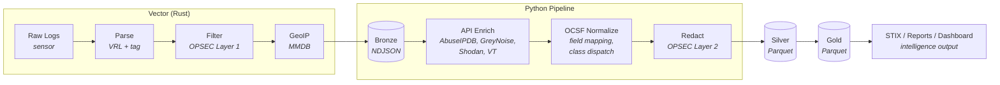

# Lantana: Data Pipeline

The Lantana data pipeline is a Python application that processes honeypot telemetry through a three-tier data lake (bronze, silver, gold), producing enriched Parquet datasets, threat intelligence reports, STIX bundles, and an operator dashboard. It runs on the Collector zone as a set of daily batch jobs orchestrated by cron.

---

## 1. Overview

Vector writes raw honeypot logs to the **bronze** layer as NDJSON files. The Python pipeline reads bronze, enriches it with external threat intelligence APIs, normalizes events to [OCSF](https://ocsf.io/) (Open Cybersecurity Schema Framework), redacts infrastructure IPs (OPSEC), and writes the result to the **silver** layer as Parquet. A second stage aggregates silver into the **gold** layer for dashboards and intelligence output.



### Why Python instead of Vector for enrichment and normalization?

Vector handles high-throughput ingest, parsing, noise filtering, and GeoIP enrichment at wire speed. The Python pipeline handles work that doesn't fit a streaming model:

- **API enrichment** requires rate-limited HTTP calls with caching, retries, and backoff — better suited to async Python with SQLite cache than VRL.
- **OCSF normalization** involves conditional class dispatch (which OCSF event class each raw event maps to) based on event type — complex branching logic that's easier to test and maintain in Python.
- **OPSEC redaction** is a safety-critical step that benefits from Pydantic validation and comprehensive test coverage.
- **Gold aggregation** produces cross-dataset correlations (behavioral progression, campaign clustering) that require Polars DataFrame operations.

Bronze stays raw. This preserves the option to re-normalize if the OCSF mapping changes without re-ingesting from the honeypots.

---

## 2. Datalake Structure

All data lives under `/var/lib/lantana/datalake/` in Hive-style partitions:

```text
/var/lib/lantana/datalake/
├── bronze/                                    # Raw NDJSON (Vector writes)
│   └── dataset={name}/date={YYYY-MM-DD}/server={hostname}/events.json
├── silver/                                    # Enriched + OCSF-normalized Parquet
│   └── dataset={name}/date={YYYY-MM-DD}/server={hostname}/events.parquet
└── gold/                                      # Aggregated intelligence Parquet
    └── {table_name}/date={YYYY-MM-DD}/summary.parquet
```

- **Bronze**: One NDJSON file per dataset/date/server combination. Written by Vector. Contains raw event fields plus Vector-added tags (`dataset`, `server`, `operation`) and GeoIP fields (`geo.*`).
- **Silver**: One Parquet file per partition. Events have OCSF-normalized column names, API enrichment data, and infrastructure IPs replaced with pseudonyms.
- **Gold**: Seven aggregated tables per date: `daily_summary`, `ip_reputation`, `behavioral_progression`, `behavioral_progression_multiday`, `campaign_clusters`, `geographic_summary`, `detection_findings`. Read exclusively from silver.

Multiple operations coexist via the `operation` column tag, not filesystem partitions.

---

## 3. Pipeline Stages

### 3.1 Bronze to Silver (daily enrichment)

Entry point: `lantana-enrich` (cron: 01:00 UTC, processes yesterday's data).

For each dataset (cowrie, suricata, nftables, dionaea):

1. **Read bronze** NDJSON into a Polars DataFrame
2. **Extract unique source IPs** from attacker events
3. **Query enrichment providers** sequentially (respecting rate limits):
   - AbuseIPDB (abuse confidence, report count, ISP)
   - GreyNoise (classification, noise/riot status)
   - Shodan (open ports, services, vulns)
   - VirusTotal (file hash reputation, for cowrie/dionaea downloads)
   - PhishStats (phishing URL count per IP)
4. **Cache results** in SQLite (7-day TTL) to avoid re-querying known IPs
5. **Record errors** — classify failures by type (rate limit, timeout, auth, HTTP error) and write an NDJSON summary to `enrichment_errors.json` at the end of each run
6. **Merge enrichment** columns back into the event DataFrame by source IP
6. **OCSF normalize** — rename columns and add OCSF metadata (see Section 4)
7. **Redact infrastructure IPs** (OPSEC Layer 2) — replace destination IPs with pseudonyms
8. **Validate no leaks** — assert zero infrastructure IPs in any string column
9. **Write silver** Parquet partitioned by dataset/date/server

### 3.2 Silver to Gold (daily aggregation)

Entry point: `lantana-transform` (cron: 02:00 UTC, processes yesterday's data).

Reads all silver Parquet for the target date (cross-dataset), collects into a single DataFrame, and computes gold tables covering: daily aggregate statistics, per-IP risk scoring (composite of behavioral signals and all enrichment providers), behavioral progression staging (scan -> credential -> authenticated -> interactive), cross-day slow-burn detection (7-day lookback), credential-sharing campaign clusters, geographic distribution of attack origins, and IDS detection finding statistics.

Gold tables are the single source of truth for all downstream output (STIX, reports, dashboard). Each table is a pure DataFrame transform — no side effects, no external calls. See [`transform/metrics.py`](../pipeline/src/lantana/transform/metrics.py) for table definitions and computation logic, and [`transform/runner.py`](../pipeline/src/lantana/transform/runner.py) for orchestration.

### 3.3 Intelligence Output

All three output channels read exclusively from gold tables (already OPSEC-redacted). The specific sections, visualizations, and object types are defined in source code and may evolve — this document describes the architecture, not the exact content.

#### STIX 2.1 Bundles

Generated from gold data via [`intel/stix.py`](../pipeline/src/lantana/intel/stix.py). Produces a STIX Bundle with IP indicators (risk-based threshold), campaign objects (credential clusters), malware indicators (captured file hashes), IDS finding indicators (broadly-triggered detection rules), and relationship objects linking them. Each indicator includes enrichment context from all available providers (GeoIP, AbuseIPDB, GreyNoise, Shodan, VirusTotal) in its description and labels.

OPSEC enforcement: the bundle serializer asserts no infrastructure IPs appear in the output. Gold reads only from redacted silver, providing defense in depth.

Available via the Streamlit dashboard (download button) or programmatic API.

#### Discord Intel Reports

Generated from gold data via [`notify/report.py`](../pipeline/src/lantana/notify/report.py), sent via `lantana-report`. The daily brief covers key metrics, geographic origin, escalation funnel, top attackers, threat actor attribution (GreyNoise-named actors), notable escalations, campaign clusters, detection highlights (top IDS rules), malware captured, and top credentials/commands. The Discord embed contains a short summary; the full Markdown report is attached as a `.md` file.

#### Streamlit Dashboard

Entry point: `lantana-dashboard`. The dashboard is the operator's personal console — never shared externally. Peers receive Discord reports and STIX bundles. Pages cover operational overview, geographic analysis (world map, country/ASN/city breakdowns), per-IP risk profiles with full enrichment detail, behavioral progression analysis, IDS detection findings, credential intelligence, and STIX export. See [`dashboard/pages/`](../pipeline/src/lantana/dashboard/pages/) for the current page set.

---

## 4. OCSF Normalization

The pipeline normalizes bronze events to [OCSF v1.3.0](https://schema.ocsf.io/1.3.0/) during the bronze-to-silver transition. Each raw event is classified into an OCSF event class based on its source dataset and event type, using a dispatch model:

1. **Class dispatch** — Each dataset (Cowrie, Suricata, nftables, Dionaea) has a normalizer function that inspects event fields (e.g., `eventid`, `event_type`, `credential_username`) to determine the OCSF event class: Authentication (3002), Process Activity (1007), File Activity (1001), Detection Finding (2004), or Network Activity (4001 — the fallback).
2. **Field mapping** — Raw fields are renamed to OCSF equivalents (e.g., `src_ip` -> `src_endpoint_ip`, `timestamp` -> `time`). Some fields are conditionally mapped based on event type (e.g., `password` only populated for login events). Intel-valuable fields (passwords, protocols, alert metadata) are never dropped during mapping.
3. **OCSF metadata** — Generated columns (`class_uid`, `category_uid`, `severity_id`, `activity_id`, `type_uid`, `status_id`) are added based on the dispatched class and event context.
4. **Passthrough** — Vector tags (`dataset`, `server`, `operation`), GeoIP fields (`geo.*`), and API enrichment columns (`abuseipdb_*`, `greynoise_*`, `shodan_*`, `vt_*`, `phishstats_*`) pass through untouched.

The OCSF schema contract is defined in [`models/ocsf.py`](../pipeline/src/lantana/models/ocsf.py). Per-dataset normalization logic (class dispatch, field mapping, and metadata generation) is in [`models/normalize.py`](../pipeline/src/lantana/models/normalize.py).

---

## 5. OPSEC: Three-Layer IP Redaction Model

Lantana produces shareable intelligence (Discord reports, STIX bundles). The primary OPSEC concern is **external/WAN IP leakage** — the public-facing addresses that identify the honeypot on the internet. If an attacker or peer discovers these, they can blacklist the honeypot, fingerprint the setup, or map the operator's infrastructure. Only the honeypot owner should know these addresses.

Three layers enforce this, each catching what the previous layer might miss:

### Layer 1: Vector Noise Filter (Sensor/Honeywall)

- **Where**: VRL transforms in each honeypot's Vector pipeline, before data leaves the sensor.
- **What**: Drops events where the source IP is not an external attacker. Filtered sources: loopback (`127.0.0.0/8`, `::1`), internal network prefixes (`network.prefixes.ipv4`, `network.prefixes.ipv6`). This catches health check probes, inter-zone traffic, and operational noise.
- **Why here**: Eliminating noise at the earliest point reduces data volume, prevents internal IPs from reaching the datalake, and avoids polluting enrichment queries with non-attacker IPs.
- **Pattern**: Each honeypot role's Vector config includes a `filter_<honeypot>` transform using `ip_cidr_contains!()` against the operation's network prefixes. Every new honeypot role must replicate this filter.

### Layer 2: Silver Redaction (Python Pipeline)

- **Where**: `common/redact.py`, called during bronze-to-silver enrichment.
- **What**: Replaces infrastructure **destination** IPs with pseudonyms. External/WAN IPs are the primary target (e.g., `172.31.99.129` -> `honeypot-wan`), but internal IPs are also redacted for defense in depth. After replacement, `validate_no_leaks()` scans every string column and asserts zero infrastructure IPs remain — both direct matches and CIDR containment checks.
- **Why here**: Layer 1 filters by source IP; Layer 2 handles destination IPs that appear in event data (the honeypot's own address). This is the last point where the pipeline has access to the real IPs (via `reporting.json` pseudonym map).
- **Configuration**: Controlled by `reporting.json` -> `redact.infrastructure_ips`, `redact.infrastructure_cidrs`, and `redact.pseudonym_map`. The Ansible template merges infrastructure IPs from `network.yml` at deploy time.

### Layer 3: Gold/Reports/STIX Absence (Python Pipeline)

- **Where**: Gold aggregation, Discord reports, STIX bundles.
- **What**: Gold reads exclusively from silver (already redacted). The STIX bundle serializer asserts no infrastructure IPs in the output JSON. Discord reports are generated from gold data only. Reports never contain: honeypot WAN IPs, internal IPs, server hostnames, network topology, SSH admin port, interface names, or CIDRs.
- **Why here**: Defense in depth. Even if a bug in Layer 2 allowed a leak into silver, Layer 3 would catch it at output time. The STIX assertion is an explicit programmatic check, not just a data flow guarantee.

---

## 6. Operational Tools

### lantana-prune (retention and disk monitoring)

Entry point: `lantana-prune` (cron: 00:15 UTC daily).

1. **Standard prune**: Delete datalake date partitions and sensor artifacts (downloads, TTY recordings) older than 180 days
2. **Disk check**: Measure filesystem usage on the datalake volume
3. **Warning** (>70%): Send Discord notification via `lantana-notify`
4. **Critical** (>80%): Emergency prune — delete sensor artifacts older than 14 days (preserves recent forensic evidence), then send critical alert with before/after usage percentages

### lantana-notify (Discord notifications)

Entry point: `lantana-notify --level <info|warning|critical> --title "..." --message "..."`

General-purpose Discord webhook notification utility. Used by:

- `lantana-prune` for disk alerts
- `lantana-report` for daily intel briefs

Webhook URL resolution chain: `--webhook-url` CLI flag > `LANTANA_DISCORD_WEBHOOK` env var > `discord_webhook` in `secrets.json`.

Notifications use Discord embeds with color-coded severity (green=info, orange=warning, red=critical) and optional file attachments. Retries 3 times with exponential backoff on failure.

---

## 7. Deployment

The pipeline is deployed by Ansible as part of the `profile_collector` role:

1. **Source sync**: `pipeline/` directory synced to `/opt/lantana/pipeline/src/`
2. **Virtual environment**: Python 3.13 venv at `/opt/lantana/pipeline/venv/`
3. **Package install**: `pip install` into the venv
4. **Cron schedule** (`/etc/cron.d/lantana-pipeline`):

| Time (UTC) | Command | Description |
| --- | --- | --- |
| 00:15 | `lantana-prune` | Retention + disk monitoring |
| 01:00 | `lantana-enrich` | Bronze -> Silver (yesterday) |
| 02:00 | `lantana-transform` | Silver -> Gold (yesterday) |

All cron jobs run as the `nectar` user (UID 2002), which owns the datalake directories. The pipeline reads `secrets.json` and `reporting.json` from `/etc/lantana/collector/`.

---

## 8. CLI Entry Points

| Command | Module | Description |
| --- | --- | --- |
| `lantana-enrich` | `lantana.enrichment.runner` | Bronze-to-silver daily enrichment |
| `lantana-transform` | `lantana.transform.runner` | Silver-to-gold aggregation |
| `lantana-prune` | `lantana.prune` | Datalake retention + disk monitoring |
| `lantana-notify` | `lantana.notify.cli` | Discord webhook notification |
| `lantana-report` | `lantana.notify.discord` | Generate and send Discord intel reports |
| `lantana-dashboard` | `lantana.dashboard.app` | Streamlit operator console |

---

## 9. Project Layout

```text
pipeline/
├── pyproject.toml                    # Dependencies, scripts, tool config
├── src/lantana/
│   ├── common/
│   │   ├── config.py                 # Load secrets.json and reporting.json
│   │   ├── datalake.py               # Read/write bronze, silver, gold partitions
│   │   └── redact.py                 # OPSEC Layer 2: pseudonymization + leak validation
│   ├── models/
│   │   ├── ocsf.py                   # OCSF Pydantic models (schema contract)
│   │   ├── normalize.py              # Bronze -> OCSF normalization functions
│   │   └── schema.py                 # Bronze Polars schema definitions
│   ├── enrichment/
│   │   ├── runner.py                 # Main enrichment orchestrator
│   │   └── providers/                # AbuseIPDB, GreyNoise, PhishStats, Shodan, VirusTotal
│   ├── transform/
│   │   ├── runner.py                 # Gold aggregation orchestrator
│   │   └── metrics.py                # 7 metric functions (summary, reputation, progression, multiday, clusters, geographic, findings)
│   ├── intel/
│   │   └── stix.py                   # STIX 2.1 bundle generation
│   ├── notify/
│   │   ├── cli.py                    # Discord webhook CLI
│   │   ├── discord.py                # Notification sending + report CLI entry
│   │   └── report.py                 # Markdown daily brief generation
│   ├── dashboard/
│   │   ├── app.py                    # Streamlit entry point + navigation
│   │   └── pages/                    # 7 pages: overview, geography, ip_reputation, progression, findings, credentials, stix_export
│   └── prune.py                      # Retention and disk monitoring
└── tests/                            # Tests mirroring src/ structure
```

---

## 10. Dependencies

- **Core**: Polars (DataFrames), httpx (async HTTP), Pydantic (validation), tenacity (retries), structlog (logging), stix2 (STIX 2.1), Streamlit (dashboard), Plotly (geographic visualizations).
- **Dev**: pytest, pytest-asyncio, ruff (lint + format), mypy (strict type checking).
- **Target runtime**: Python 3.13+ (Debian 13 native).
- **Package manager**: uv.
